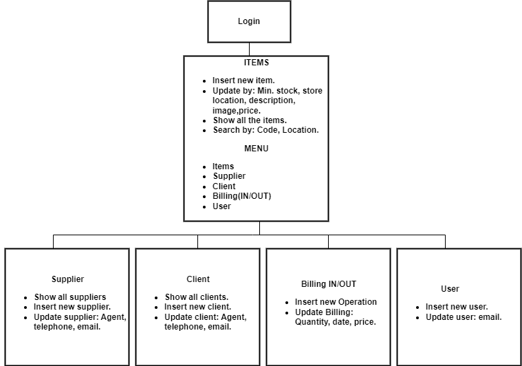

<h1>Inventory_MS</h1>

This a personal project to heance my programing skills

<h3>Workflow of the project:</h3>
 

<h2>Description</h2>

 Inventory management system. 

<strong>Technologies:</strong>

<ul>
<li><em>Language:</em> Python 3.10</li>
<li><em>GUI:</em> Tkinter</li>
<li><em>Database:</em> Posgres(psycopg2)</li>
<li><em>Test:</em> unittest</li>
</ul>

 <h3>Online references:</h2>
     - <a href="https://www.youtube.com/watch?v=t-lUX5e6fOY">Youtube video</a>
   